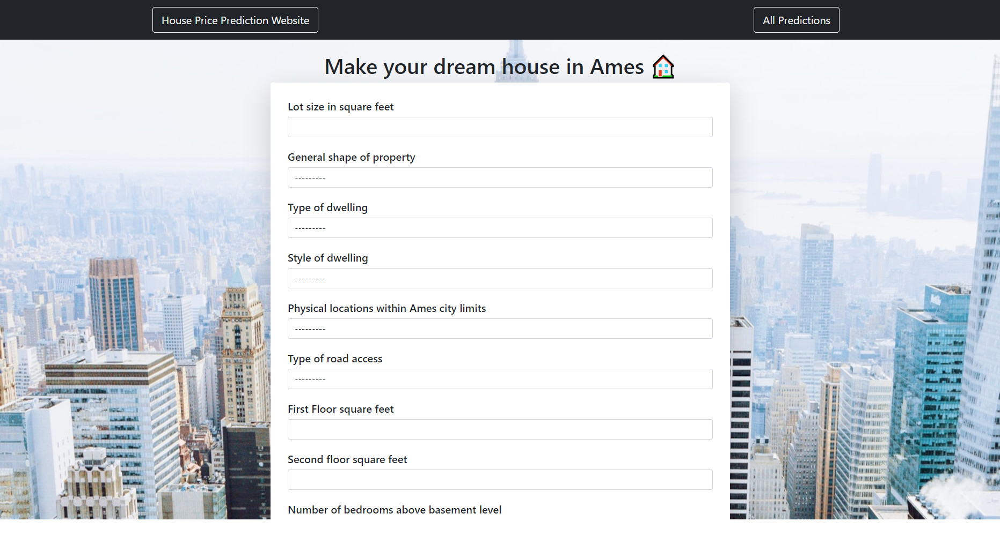

<h1 align="center">💲🏡 House-price-predictor</h1>


## Table of Contents

 - [First look](https://github.com/maciekmalachowski/House-price-predictor#first-look)
 - [Installation](https://github.com/maciekmalachowski/House-price-predictor#installation)
 - [Fields](https://github.com/maciekmalachowski/House-price-predictor#fields)
 - [App appearance](https://github.com/maciekmalachowski/House-price-predictor#app-appearance)
 
 <br>
 
<h1 align="center"> First look 👀 </h1>

#### Predictor is a web application built on `django`. It uses models written in `jupyter-notebook`, which are responsible for all predictions. 

#### To select the parameters of the house, the application uses `django-forms`, which automatically enters the data into the database and returns the result of the prediction in the form of price and details that we selected for our dream house in **Ames city**. 

<br>

<h1 align="center"> Installation ℹ </h1>
 
First, you need to install the requirements contained in the ``requirements.txt``. Open your shell and paste the following comands.
```
pip install -r requirements.txt
```
Then you have to go to ``server`` folder 
```
cd House-price-predictor/server
```
Next run server with this command
```
manage.py runserver
```
After that you will see a link leading to our application and it looks like this:
```
http://127.0.0.1:8000/
```
Copy and paste it into browser window to *open the application*.

<br>

 <h1 align="center"> Fields ☑</h1>
 
To create your dream house you have many options to choose from, such as:
 
- **Lot size in square feet**
- **General shape of property**
- **Type of dwelling**
- **Style of dwelling**
- **Physical locations within Ames city limits**
- **Type of road access**
- **First Floor square feet**
- **Second floor square feet**
- **Number of bedrooms above basement level**
- **Number of kitchens**
- **Total rooms above grade (does not include bathrooms)**
- **Full bathrooms above grade**
- **Basement quality**
- **Total square feet of basement area**
- **Basement full bathrooms**
- **Garage type**
- **Size of garage in square feet**
- **Type of roof**
- **Roof material**
- **Type of foundation**
- **Paved driveway**
- **Open porch area in square feet**
- **Pool area in square feet**
- **Heating quality and condition**
- **Central air conditioning**
- **Electrical system**

 <h1 align="center"> App appearance 🔍</h1>
 
The application is divided into three parts: 
- **Main** part, where you choose from among the given fields which house we are interested in.
- **Predictions** part, where all our created houses are displayed together with their estimated price.
- **Details** part, where you can see our selections when creating the house.

<br>

## Main

After clicking `Make prediction` button you will be taken to the next page, where previous predictions are displayed
and your last prediction will be displayed at the bottom



###### If you do not see the gif below, please wait a moment


<br>

## Predictions and details

To go to the details of the prediction click on it, it will take you to the next page, where you will find the details


#### More images and gifs can be found in the `media` folder.


